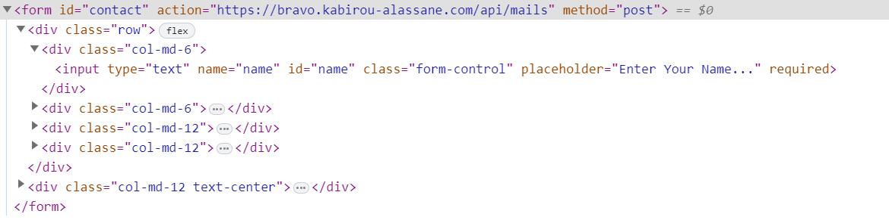

# Bravo-mailer

Bravo-mailer is a project, a mini web platform for sending mail using an API provided.
The idea came to me when I was developing my [Portfolio](https://kabirou-alassane.com) using front-end technologies, i.e. my [portfolio](https://kabirou-alassane.com) should be totally static without any recourse to a backend, so I encountered difficulties when sending mails at the level of my contact form, I tried to use the famous formspree.io but over time when I changed my domain name I had some problems. So, I decided to write my own platform for managing and sending emails, in the form of an API.

Now, with this project which is not yet graphical, but in REST API, I can communicate by SMTP with my mail server and send mails from my certified domains without worries.

The other information is that I used my `personal mini PHP framework` that I call [BRAVO](https://github.com/BlakvGhost/Bravo) (although this is the first version, not yet very efficient, but hey, it works, and I will certainly update it soon) .

## Documentation:

Documentation for Bravo is currently being prepared and will be available soon. Stay tuned for updates!

# How to use:
Below is an example of using the API

All project code is based on my [BRAVO](https://github.com/BlakvGhost/Bravo) v1.0.0 framework, so please do a `composer install` to see this code.

## Authors

- [Kabirou ALASSANE](https://github.com/BlakvGhost)

## Support

For support, you can reach out to me by email at <dev@kabirou-alassane.com>. Feel free to contact me if you have any questions or need assistance with Bravo.

## License

This project is licensed under the MIT License.